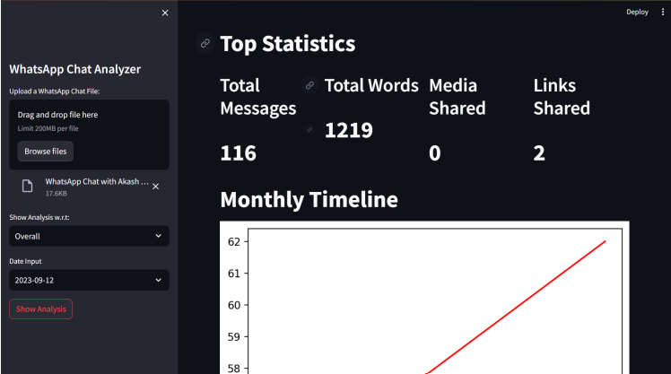
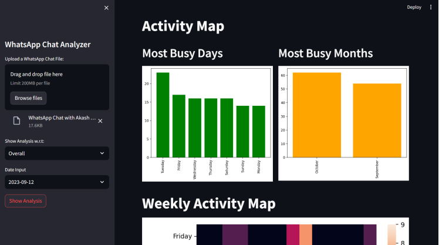
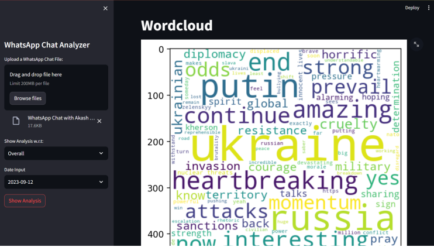
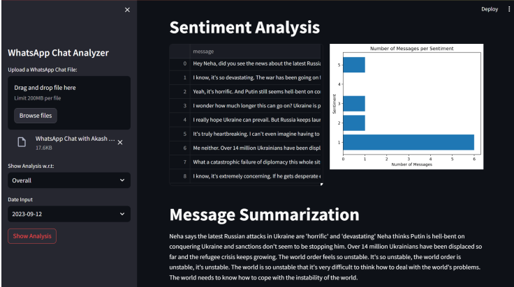

# WhatsApp Chat Analyzer

This project is a comprehensive analysis of WhatsApp chats, employing various techniques such as message count, word frequency, temporal patterns, participant activity, emoji usage, sentiment analysis, and text summarization. The analysis is performed using advanced natural language processing techniques, particularly the BERT model.

## Features

- Message count and word frequency analysis
- Temporal pattern analysis (daily and monthly activity)
- Identification of active participants
- Emoji usage analysis
- Sentiment analysis using BERT
- Text summarization using BERT and BART models

## Installation

1. Clone the repository:

```bash
git clone https://github.com/your-username/whatsapp-chat-analyzer.git
```

2. Install the required dependencies:

```bash
pip install -r requirements.txt
```

## Usage
1. Run the Streamlit app:
```bash
streamlit run app.py
```
2. Upload your WhatsApp chat file (.txt format) in the provided interface.
3. The analysis results will be displayed, including visualizations and insights.

## Results





## License

This project is licensed under the [GNU General Public License v3.0](LICENSE).
